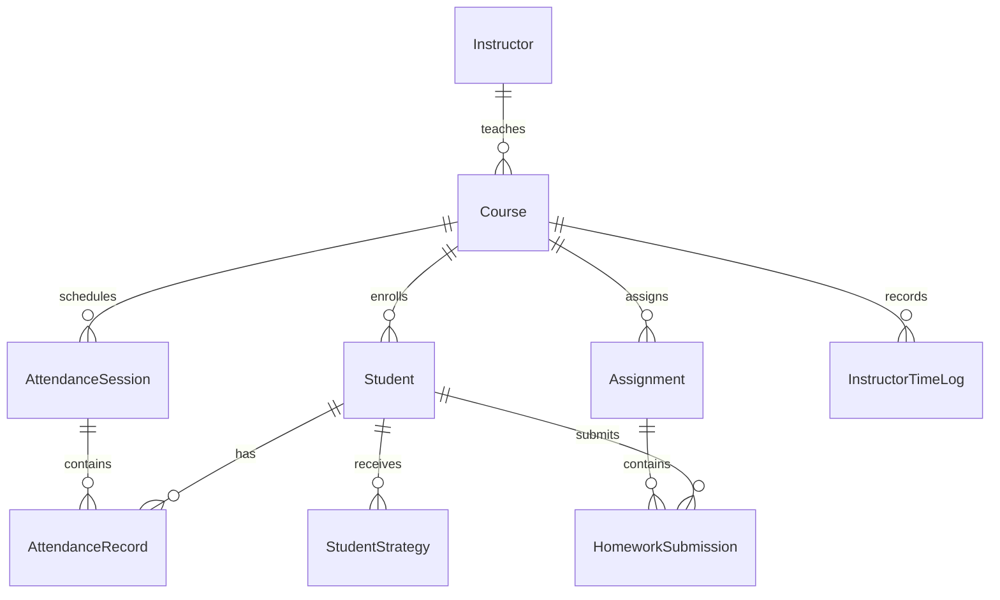

# Database & Data Layer Technical Design Document

## 1. Overview & Cloud Architecture

The **InstructorLMS** data layer is powered by **Neon Serverless PostgreSQL** and managed through **Prisma ORM (v5)**.

### Key Database Features:
- **Serverless PostgreSQL**: Hosted on Neon Cloud (`us-east-2`), featuring autoscaling and automatic compute suspension when idle ($0 cost footprint).
- **Dual Connection Architecture**:
  1. **Pooled Connection (`DATABASE_URL`)**: Utilizes Neon's transaction pooler (`-pooler.c-6...`) for serverless query execution. Prevents connection exhaustion during web requests.
  2. **Direct Connection (`DATABASE_URL_UNPOOLED` / `DIRECT_URL`)**: Direct TCP connection (`ep-holy-frog...`) used strictly for schema migrations and `prisma db push` operations.
- **Relational Integrity**: Defined strictly via Prisma schema with explicit foreign keys, composite unique constraints, and `onDelete: Cascade` rules to ensure orphan data is never left behind when a course or student is deleted.

---

## 2. Prisma Schema Specification ([`prisma/schema.prisma`](file:///e:/My_GitHub__projects/InstructorLMS/prisma/schema.prisma))

```prisma
datasource db {
  provider  = "postgresql"
  url       = env("DATABASE_URL")
  directUrl = env("DATABASE_URL_UNPOOLED")
}

generator client {
  provider = "prisma-client-js"
}
```

---

## 3. Detailed Data Models & Entity Relationships



### A. Model: `Instructor`
Represents an instructor or institutional administrator user account.
- **`id`** (`String`, `@id`, `@default(cuid())`): Unique CUID identifier.
- **`email`** (`String`, `@unique`): Instructor email address.
- **`name`** (`String`): Instructor full name.
- **`role`** (`String`, `@default("INSTRUCTOR")`): System role: `"INSTRUCTOR"` (standard course educator) or `"ADMIN"` (institutional administrator with elevated privileges).
- **`avatarUrl`** (`String?`): Relative URL path to Next.js static asset (e.g. `/avatars/instructors/alex-vance.jpg`). Zero blobs in DB.
- **`createdAt`** (`DateTime`, `@default(now())`): Account creation timestamp.
- **Relations**: Has many `Course` records.

---

### B. Model: `Course`
Represents an academic course (e.g. CS101, DS201).
- **`id`** (`String`, `@id`, `@default(cuid())`): Unique CUID.
- **`instructorId`** (`String`): Foreign key to `Instructor.id`.
- **`name`** (`String`): Course name (e.g. "Web Development Fundamentals").
- **`code`** (`String`): Course code (e.g. "CS101").
- **`term`** (`String`): Academic term (e.g. "Fall 2026").
- **`defaultClassLengthMinutes`** (`Int`, `@default(60)`): Default session duration.
- **`createdAt`** (`DateTime`, `@default(now())`).
- **Relations**: Belongs to `Instructor` (`onDelete: Cascade`). Has many `Student`, `AttendanceSession`, `Assignment`, `InstructorTimeLog`.

---

### C. Model: `Student`
Represents an enrolled student within a course section.
- **`id`** (`String`, `@id`, `@default(cuid())`): Unique CUID.
- **`courseId`** (`String`): Foreign key to `Course.id`.
- **`name`** (`String`): Student full name.
- **`email`** (`String?`): Optional student email address.
- **`avatarUrl`** (`String?`): Relative URL path to Next.js static asset (e.g. `/avatars/students/student-1.jpg`).
- **`isRemoved`** (`Boolean`, `@default(false)`): Soft-delete flag allowing archiving/restoring students while preserving historic attendance and homework records.
- **`createdAt`** (`DateTime`, `@default(now())`).
- **Relations**: Belongs to `Course` (`onDelete: Cascade`). Has many `AttendanceRecord`, `HomeworkSubmission`, `StudentStrategy`.

---

### D. Model: `AttendanceSession`
Represents a specific dated class meeting.
- **`id`** (`String`, `@id`, `@default(cuid())`): Unique CUID.
- **`courseId`** (`String`): Foreign key to `Course.id`.
- **`date`** (`DateTime`): Class date & time.
- **`notes`** (`String?`): Optional session notes.
- **`createdAt`** (`DateTime`, `@default(now())`).
- **Relations**: Belongs to `Course` (`onDelete: Cascade`). Has many `AttendanceRecord`.

---

### E. Model: `AttendanceRecord`
Pivot table storing attendance status for a student in a specific session.
- **`id`** (`String`, `@id`, `@default(cuid())`): Unique CUID.
- **`sessionId`** (`String`): Foreign key to `AttendanceSession.id`.
- **`studentId`** (`String`): Foreign key to `Student.id`.
- **`status`** (`String`, `@default("PRESENT")`): Enum string: `"PRESENT"`, `"LATE"`, or `"ABSENT"`.
- **`updatedAt`** (`DateTime`, `@updatedAt`): Automatic last update timestamp.
- **Indexes & Constraints**:
  - `@@unique([sessionId, studentId])`: Guarantees a student can only have one attendance status per session.
- **Relations**: Belongs to `AttendanceSession` (`onDelete: Cascade`), `Student` (`onDelete: Cascade`).

---

### F. Model: `Assignment`
Represents a deliverable item (homework, quiz, or presentation).
- **`id`** (`String`, `@id`, `@default(cuid())`): Unique CUID.
- **`courseId`** (`String`): Foreign key to `Course.id`.
- **`title`** (`String`): Assignment title.
- **`type`** (`String`, `@default("HOMEWORK")`): Enum string: `"HOMEWORK"`, `"QUIZ"`, or `"PRESENTATION"`.
- **`dueDate`** (`DateTime`): Assignment due date.
- **`totalPoints`** (`Int`, `@default(100)`): Total possible points.
- **`createdAt`** (`DateTime`, `@default(now())`).
- **Relations**: Belongs to `Course` (`onDelete: Cascade`). Has many `HomeworkSubmission`.

---

### G. Model: `HomeworkSubmission`
Pivot table storing homework status and grade for a student's assignment.
- **`id`** (`String`, `@id`, `@default(cuid())`): Unique CUID.
- **`assignmentId`** (`String`): Foreign key to `Assignment.id`.
- **`studentId`** (`String`): Foreign key to `Student.id`.
- **`status`** (`String`, `@default("MISSING")`): Enum string: `"MISSING"`, `"SUBMITTED"`, or `"GRADED"`.
- **`grade`** (`Float?`): Numeric score (e.g. 88.5). `null` if not graded yet.
- **`updatedAt`** (`DateTime`, `@updatedAt`).
- **Indexes & Constraints**:
  - `@@unique([assignmentId, studentId])`: Guarantees one submission record per student per assignment.
- **Relations**: Belongs to `Assignment` (`onDelete: Cascade`), `Student` (`onDelete: Cascade`).

---

### H. Model: `StudentStrategy`
Stores custom intervention and academic improvement strategies for at-risk or monitored students.
- **`id`** (`String`, `@id`, `@default(cuid())`): Unique CUID.
- **`studentId`** (`String`): Foreign key to `Student.id`.
- **`strategyNotes`** (`String`): Free-form markdown/text notes.
- **`updatedAt`** (`DateTime`, `@updatedAt`).
- **Relations**: Belongs to `Student` (`onDelete: Cascade`).

---

### I. Model: `InstructorTimeLog`
Tracks administrative labor, prep time, and contact hours.
- **`id`** (`String`, `@id`, `@default(cuid())`): Unique CUID.
- **`courseId`** (`String`): Foreign key to `Course.id`.
- **`sessionDate`** (`DateTime`): Log entry date.
- **`prepTimeHours`** (`Float`, `@default(0)`): Preparation time in decimal hours (e.g. 1.5).
- **`contactHours`** (`Float`, `@default(0)`): Teaching contact time in decimal hours (e.g. 2.0).
- **`notes`** (`String?`): Session log notes.
- **`createdAt`** (`DateTime`, `@default(now())`).
- **Relations**: Belongs to `Course` (`onDelete: Cascade`).

---

## 4. Prisma Client Singleton Pattern ([`src/lib/prisma.ts`](file:///e:/My_GitHub__projects/InstructorLMS/src/lib/prisma.ts))

To prevent exhausting connection pools during Next.js Hot Module Replacement (HMR) in development, Prisma Client is instantiated using a global singleton:

```typescript
import { PrismaClient } from '@prisma/client';

const globalForPrisma = globalThis as unknown as {
  prisma: PrismaClient | undefined;
};

export const prisma = globalForPrisma.prisma ?? new PrismaClient();

if (process.env.NODE_ENV !== 'production') globalForPrisma.prisma = prisma;
```

---

## 5. How to Request Future Schema Changes

When requesting database modifications or new features:

1. **Adding a New Field to an Existing Model**:
   - Edit [`prisma/schema.prisma`](file:///e:/My_GitHub__projects/InstructorLMS/prisma/schema.prisma).
   - Run schema sync to Neon Cloud:
     ```bash
     npx prisma db push
     ```
2. **Adding a New Model**:
   - Define model fields, CUID primary keys, and relationships in [`prisma/schema.prisma`](file:///e:/My_GitHub__projects/InstructorLMS/prisma/schema.prisma).
   - Execute `npx prisma db push` to create table structures on Neon PostgreSQL.
   - Update [`prisma/seed.ts`](file:///e:/My_GitHub__projects/InstructorLMS/prisma/seed.ts) if sample data is required.
3. **Resetting / Re-seeding Data**:
   - Run `npm run seed` to re-populate sample data.

---

## 6. Asset & Profile Picture Storage Architecture (Zero-Blob / $0 Tier)

### Architectural Constraints:
- **No Database Blobs**: Image binary data (byte arrays, Base64 strings, or blobs) is strictly forbidden from being stored in Neon PostgreSQL tables.
- **Cost & Performance Rationale**: Storing images in relational rows causes severe table bloat, degrades query cache performance, inflates PostgreSQL connection memory usage, and triggers unnecessary cloud network egress charges.
- **Decoupled URL References**:
  - Image files are hosted as Next.js static site assets under `/public/avatars/`.
  - Neon PostgreSQL tables (`Instructor` and `Student`) store only a lightweight, nullable relative URL string (`avatarUrl String?`), e.g., `/avatars/instructors/alex-vance.jpg` or `/avatars/students/student-1.jpg`.
  - Fallback handling: When `avatarUrl` is null or undefined, the client UI gracefully falls back to `/avatars/default-avatar.svg`.
  - Dynamic user uploads/camera captures are saved to disk via `/api/upload-avatar` writing into `public/avatars/uploads/`.
