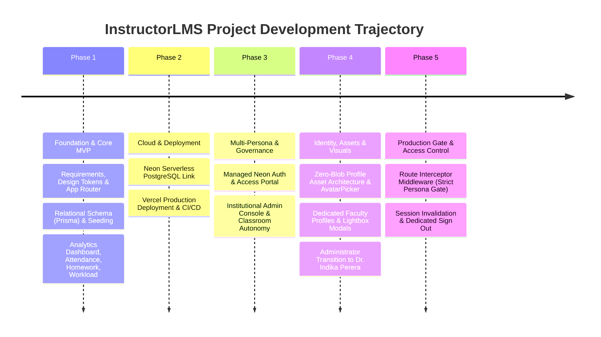

# InstructorLMS Development Log & Project History

This log records the chronological development trajectory of the **InstructorLMS** application, summarizing features built, bugs encountered and fixed, roadblocks overcome, and production deployment milestones.

---

## Chronological Development Timeline

---

## Phase 1: Foundation & Core MVP

### 📅 Milestone 1: Requirements Alignment & Foundation Setup
**Tasks Completed:**
- Established core vision: Single-instructor LMS focusing on high density, zero operating cost, and fast UI interaction.
- Created Next.js 14 application with TypeScript, Tailwind CSS, Lucide icons, and App Router structure.
- Designed dark-mode color tokens (Slate/Zinc backdrops, Emerald present, Amber late, Rose absent, Indigo actions).
- Built responsive layout wrapper with persistent navigation sidebar ([`src/components/Sidebar.tsx`](file:///e:/My_GitHub__projects/InstructorLMS/src/components/Sidebar.tsx)).

---

### 📅 Milestone 2: Data Modeling & Local Database Seeding
**Tasks Completed:**
- Defined 9 core relational data models in [`prisma/schema.prisma`](file:///e:/My_GitHub__projects/InstructorLMS/prisma/schema.prisma): `Instructor`, `Course`, `Student`, `AttendanceSession`, `AttendanceRecord`, `Assignment`, `HomeworkSubmission`, `StudentStrategy`, `InstructorTimeLog`.
- Created relational cascade rules (`onDelete: Cascade`) and composite unique constraints (`[sessionId, studentId]`, `[assignmentId, studentId]`).
- Developed realistic fictitious seed script ([`prisma/seed.ts`](file:///e:/My_GitHub__projects/InstructorLMS/prisma/seed.ts)) populating instructor accounts, courses (CS101, DS201), students, attendance sessions, homework submissions, and workload prep/contact logs.

---

### 📅 Milestone 3: Core UI Pages & Server Actions Implementation
**Tasks Completed:**
1. **Executive Class Analytics Dashboard (`/`)**:
   - Built Top 4 KPI summary cards (Enrolled Students, Attendance %, Homework Completion %, Total Workload Hours).
   - Integrated At-Risk student notification banner identifying students with <80% attendance or missing assignments.
2. **Lightning Attendance Tracker (`/attendance`)**:
   - Created roster checklist with single-click status toggling (`PRESENT`, `LATE`, `ABSENT`).
   - Implemented Server Action `toggleAttendanceRecord` for zero-reload updates.
3. **Homework Management Matrix (`/homework`)**:
   - Created Roster x Assignment matrix table with status tags (`MISSING`, `SUBMITTED`, `GRADED`) and numeric grade inputs.
   - Implemented Server Actions `updateSubmissionStatus` and `updateSubmissionGrade`.
4. **Student Roster & Performance Profiles (`/students` & `/students/[id]`)**:
   - Built student directory and detailed individual profiles with full attendance timeline breakdown.
   - Built editable Academic Strategy & Intervention Log text area with `saveStudentStrategy` Server Action.
5. **Dual-Side Workload Log (`/workload`)**:
   - Built prep hours vs contact hours logger and burnout monitoring breakdown chart.
6. **External Announcement Builder (`/announcements`)**:
   - Built draft editor with live preview and single-click clipboard copy button.

---

## Phase 2: Cloud Infrastructure & Deployment

### 📅 Milestone 4: Neon PostgreSQL Cloud Infrastructure Setup
**Tasks Completed:**
- Installed `@neon/cli` globally (`npm i -g neon@latest`).
- Initialized Neon configuration policy (`neon config init -s none`).
- Installed `@neon/config` and `@neon/env` dependencies.
- Configured [`neon.ts`](file:///e:/My_GitHub__projects/InstructorLMS/neon.ts) starter policy.
- Linked repository to Neon Cloud project `small-surf-10638308` on `production` branch (`neon link`).
- Updated [`prisma/schema.prisma`](file:///e:/My_GitHub__projects/InstructorLMS/prisma/schema.prisma) to `postgresql` provider with pooled `url` (`DATABASE_URL`) and direct `directUrl` (`DATABASE_URL_UNPOOLED`).
- Pushed schema to Neon Cloud (`npx prisma db push`) and populated live Neon PostgreSQL database with seed data (`npm run seed`).
- Deployed policy configuration (`neon deploy`).
- Installed Neon Agent Skills (`neon skills -y`) and Neon MCP server integration (`neon mcp -y`).

---

### 📅 Milestone 5: Vercel Production Deployment & Launch
**Tasks Completed:**
- Connected GitHub repository (`GitHub-ccd/InstructorLMS`) to Vercel.
- Configured production environment variables (`DATABASE_URL`, `DATABASE_URL_UNPOOLED`, `NEON_BRANCH`).
- Triggered Vercel production build and verified zero-cost global deployment.
- Executed production build check (`npm run build`) with zero compilation errors.

---

### 🐛 Phase 1 & 2 Bugs Encountered & Fixes Applied

#### Bug 1: Hot Module Replacement (HMR) Connection Exhaustion
- **Symptom**: Local development server emitted `Too many connections` warnings during rapid page saves.
- **Root Cause**: Next.js development server re-instantiated `PrismaClient` on every code change.
- **Fix**: Implemented the global singleton pattern in [`src/lib/prisma.ts`](file:///e:/My_GitHub__projects/InstructorLMS/src/lib/prisma.ts) (`globalThis.prisma`).

#### Bug 2: Attendance Double-Counting in Aggregates
- **Symptom**: Dashboard attendance percentage calculation exceeded 100% when a student's status was modified multiple times.
- **Root Cause**: `AttendanceRecord` lacked a composite unique key constraint, allowing duplicate rows for the same `(sessionId, studentId)` combination.
- **Fix**: Added `@@unique([sessionId, studentId])` constraint to `AttendanceRecord` schema and updated Server Action to use `upsert`.

#### Bug 3: Windows PowerShell Command Chaining Error
- **Symptom**: Command `npm i -g neon@latest && neon login` failed with `The token '&&' is not a valid statement separator`.
- **Root Cause**: Windows PowerShell parser does not support `&&` syntax in default execution contexts.
- **Fix**: Separated execution into single command invocations or used `;` as statement separator.

---

### 🚧 Phase 1 & 2 Roadblocks Faced & Solutions

#### Roadblock 1: Node.js Version Incompatibility for `neon skills`
- **Challenge**: Executing `neon skills -y` threw:
  `ERROR: neon skills needs Node.js 22.20.0 or newer to run the skills CLI. This process is Node.js 22.16.0.`
- **Solution**:
  1. Installed Fast Node Manager (`fnm`).
  2. Downloaded and set Node `v22.23.2` as default (`fnm default 22.23.2`).
  3. Configured user `PATH` and PowerShell profiles (`$PROFILE`) to ensure Node `v22.23.2` is active across all terminal sessions.

#### Roadblock 2: Automated Browser Driver Timeout on OAuth
- **Challenge**: Automated browser OAuth login via `neon login` timed out due to a Playwright driver v1.57.0 404 download issue in the environment.
- **Solution**: Generated direct web OAuth authentication URLs for manual user authorization, and linked project directly via `neon link --project-id small-surf-10638308`.

---

## Phase 3: Multi-Persona Governance & Autonomy

### 📅 Milestone 6: Managed Neon Auth & Instructor Access Portal
**Tasks Completed:**
1. **Damage Assessment & Recovery**:
   - Assessed repository state after agent session interruption: working tree was completely clean, zero uncommitted or corrupted files, and all architecture specifications remained intact.
2. **Neon Auth Integration**:
   - Enabled Neon Auth on the `production` branch (`neon neon-auth enable`), configuring the `better_auth` provider with managed schemas and JWKS endpoint.
   - Updated `neon.ts` policy with `auth: true` and pulled auth environment variables (`NEON_AUTH_BASE_URL`, `NEON_AUTH_JWKS_URL`, `NEON_AUTH_COOKIE_SECRET`) via `neon env pull`.
   - Installed `@neondatabase/auth` and created API proxy handler ([`src/app/api/auth/[...path]/route.ts`](file:///e:/My_GitHub__projects/InstructorLMS/src/app/api/auth/%5B...path%5D/route.ts)).
   - Built the Instructor Access Portal ([`src/app/signin/page.tsx`](file:///e:/My_GitHub__projects/InstructorLMS/src/app/signin/page.tsx)) featuring 1-click active instructor profile selection and Neon Auth magic link email verification.
3. **Database Schema Enhancements**:
   - Extended [`prisma/schema.prisma`](file:///e:/My_GitHub__projects/InstructorLMS/prisma/schema.prisma):
     - `Instructor`: added `role String @default("INSTRUCTOR")` (`INSTRUCTOR`, `ADMIN`).
     - `Assignment`: added `enum AssignmentType { HOMEWORK, QUIZ, PRESENTATION }` with `type AssignmentType @default(HOMEWORK)`.
     - `Student`: added soft-delete flag `isRemoved Boolean @default(false)`.
   - Executed `npx prisma db push` and seeded multi-instructor sample data (Administrator persona and Prof. Sarah Connor [Instructor]).
4. **Institutional Admin Portal (`/admin`)**:
   - Built [`src/app/admin/page.tsx`](file:///e:/My_GitHub__projects/InstructorLMS/src/app/admin/page.tsx) with institutional directories for Instructors, Courses, and Registered Students.
   - Implemented server actions to create new instructors with roles, configure courses, and register new students.
5. **Lightning Attendance Tracker Enhancements (`/attendance`)**:
   - Implemented strict 14-day backfill validation: instructors can pick any historical date ≤14 days ago to create or edit records; older sessions are locked.
   - Added batch save button with confirmation toasts, quick "Mark All Present" / "Mark All Absent" shortcuts, session clear, and session deletion.
6. **Homework & Assessment Matrix (`/homework`)**:
   - Added "+ Add Assignment" modal supporting Title, Due Date, Total Points, and Type selection (`HOMEWORK`, `QUIZ`, `PRESENTATION`).
   - Added color-coded badges and category filters for each assessment type.
   - Designed horizontal scrolling matrix with sticky student roster column so student names remain fixed while scrolling across wide assignment sets.
7. **Student Cohort Management & Soft-Delete (`/students` & `/students/[id]`)**:
   - Excluded `isRemoved: true` students from dashboard analytics and at-risk metrics.
   - Added Active vs Archived roster tab filter, 1-click "Remove from Cohort" (soft-delete), and instant "Restore" capabilities.
   - Added "+ Enroll Student in Class" modal allowing instructors to enroll existing students across the institution into their course.
8. **Responsive UI & Mobile Refactor**:
   - Replaced static sidebar on small viewports with a responsive topbar and slide-over navigation drawer.
   - Added responsive grid layouts (`grid-cols-1 sm:grid-cols-2 lg:grid-cols-4`) and overflow table wrappers.

---

### 📅 Milestone 7: Instructor Persona Restrictions & Autonomy Enforcements
**Tasks Completed:**
1. **Course Scheduling Separation**:
   - Instructors are restricted from creating new courses (Admin-only).
   - Added `addExistingCourseToScheduleAction` allowing instructors to select pre-approved courses from the institutional catalog and add them to their schedule.
   - Built [`AddCourseToScheduleModal.tsx`](file:///e:/My_GitHub__projects/InstructorLMS/src/components/AddCourseToScheduleModal.tsx) and [`AddCourseButton.tsx`](file:///e:/My_GitHub__projects/InstructorLMS/src/components/AddCourseButton.tsx) across Dashboard, Students, and Homework pages.
2. **Student Enrollment Restrictions**:
   - Instructors are restricted from registering new students (Admin-only).
   - Removed manual student creation form from the student enrollment modal.
   - Updated `enrollExistingStudentInCourse` to verify student pre-registration and check that the calling instructor teaches the target course.
3. **Assessment Autonomy (Create, Score, Delete)**:
   - Built `deleteAssignmentAction` with course instructor ownership verification.
   - Added a Delete button with confirmation prompt in [`HomeworkClient.tsx`](file:///e:/My_GitHub__projects/InstructorLMS/src/app/homework/HomeworkClient.tsx) on each assignment column header.
4. **Seed Catalog Expansion**:
   - Added `MATH101` and `CS350` to the institutional catalog in [`prisma/seed.ts`](file:///e:/My_GitHub__projects/InstructorLMS/prisma/seed.ts).

---

### 🐛 Phase 3 Bugs Encountered & Fixes Applied

#### Bug 4: Peer Dependency Mismatch for `@neondatabase/auth` on Next.js 14
- **Symptom**: `npm install @neondatabase/auth` failed with `ERESOLVE could not resolve peerOptional next@">=16.0.0"`.
- **Root Cause**: `@neondatabase/auth@0.5.0-beta` declared an optional peer dependency targeting Next.js 16+, which triggered npm's strict peer-resolution check on Next.js 14.
- **Fix**: Installed using `--legacy-peer-deps` (`npm install @neondatabase/auth --legacy-peer-deps`). The package functions seamlessly with Next.js 14 server handlers.

#### Bug 5: TypeScript Implicit Any in Dynamic Course Queries
- **Symptom**: `npm run build` failed with `Type error: Variable 'courses' implicitly has type 'any[]'`.
- **Root Cause**: `let courses = []` initialized an untyped empty array before conditional prisma calls.
- **Fix**: Replaced with direct ternary Prisma queries (`prisma.course.findMany({ where: activeInstructor ? { instructorId: activeInstructor.id } : {} })`).

#### Bug 6: Neon Serverless Connection Closed (`Error { kind: Closed, cause: None }`)
- **Symptom**: `prisma:error Error in PostgreSQL connection: Error { kind: Closed, cause: None }` logged in terminal after idle periods or navigation.
- **Root Cause**: Neon's pooled endpoint uses PgBouncer in transaction mode and Neon compute suspends after 5 minutes of idle time. Without `pgbouncer=true` and `connect_timeout` parameters in `DATABASE_URL`, Prisma retains prepared statements and reports idle socket closures when PgBouncer drops or recycles connections.
- **Fix**: Appended `&pgbouncer=true&connect_timeout=30` to `DATABASE_URL` in `.env` and `.env.local`. This informs Prisma to disable prepared statements for transaction pooling compatibility and allows a 30s window for Neon serverless compute resume.

---

### 🚧 Phase 3 Roadblocks Faced & Solutions

#### Roadblock 3: Playwright Driver 404 on AzureEdge CDN
- **Challenge**: Automated browser testing subagent encountered a 404 when downloading `playwright-1.57.0-win32_x64.zip` from Microsoft's Azure CDN.
- **Solution**: Executed full HTTP verification across all 8 application endpoints using Node.js fetch against the live server, confirming `200 OK` responses and complete HTML page generation.

---

## Phase 4: Media, Visual Identity & High-Density UX

### 📅 Milestone 8: Zero-Blob Profile Picture System & AvatarPicker
**Tasks Completed:**
1. **Zero-Blob Database Architecture**:
   - Strictly enforced that image binary data is not stored in Neon PostgreSQL.
   - Added `avatarUrl String?` to `Instructor` and `Student` models in `prisma/schema.prisma`.
   - Executed `npx prisma db push` to synchronize schema with remote Neon PostgreSQL without migrations.
2. **Static Site Asset Library**:
   - Created `/public/avatars/` with subdirectories: `instructors/`, `students/`, `presets/`, and `uploads/`.
   - Generated low-resolution AI headshots for existing instructors and 6 student headshots.
   - Created SVG fallback asset at `/public/avatars/default-avatar.svg`.
3. **Multi-Modal Interactive `<AvatarPicker>`**:
   - Created `src/components/AvatarPicker.tsx` with 3 input tabs: Preset Gallery, Local File Upload, and Live Webcam Capture (`navigator.mediaDevices.getUserMedia`) with snapshot shutter.
   - Created API route `src/app/api/upload-avatar/route.ts` handling both `multipart/form-data` and JSON base64 data URLs.
   - Integrated `<AvatarPicker>` into the Admin Console for adding instructors and registering students.
4. **App-Wide Avatar Display**:
   - Rendered circular avatars in Sidebar, Overview Dashboard, At-Risk cards, Student Roster cards, Student Profile header, Attendance roll-call roster, and sticky Homework matrix column.
5. **Database Seed Update**:
   - Updated `prisma/seed.ts` to assign headshots to faculty and distributed student avatars across all 26 seeded students.

---

### 📅 Milestone 9: Dedicated Instructor Profile View & Enlarged Media
**Tasks Completed:**
1. **Dedicated Instructor Profile View (`/instructors/[id]`)**:
   - Built Server Component `src/app/instructors/[id]/page.tsx` querying instructor details, assigned courses, active cohorts, and workload logs.
   - Built Client Component `src/app/instructors/[id]/InstructorProfileClient.tsx` featuring high-impact `w-36 h-36 md:w-44 md:h-44` framed headshot, workload metrics, teaching schedule cards, and labor audit history.
   - Created Server Action `updateInstructorAvatarAction` in `src/app/instructors/actions.ts` with role-based permission verification.
2. **Enlarged Profile Pictures**:
   - **Student Profile (`/students/[id]`)**: Increased avatar from `w-16 h-16` (64px) to `w-32 h-32 md:w-40 md:h-40` (128–160px).
   - **Instructor Profile (`/instructors/[id]`)**: Framed avatar rendered at `w-36 h-36 md:w-44 md:h-44`.
   - **Student Cohort Cards (`/students`)**: Increased from `w-11 h-11` (44px) to `w-16 h-16` (64px).
   - **Overview Dashboard Banner (`/`)**: Increased from `w-14 h-14` (56px) to `w-20 h-20 sm:w-24 sm:h-24` (80–96px) with direct link to profile.
   - **At-Risk Cards (`/`)**: Increased from `w-10 h-10` to `w-14 h-14`.
   - **Sidebar Footer (`Sidebar.tsx`)**: Increased from `w-10 h-10` to `w-12 h-12`.
   - **Admin Console Tables (`AdminClient.tsx`)**: Increased from `w-8 h-8` to `w-12 h-12`.
3. **Interactive Lightbox Modals**:
   - Added click-to-enlarge modal dialogs on both Student Profile and Instructor Profile views so users can inspect headshots full-size.
4. **App-Wide Navigation to Instructor Profile**:
   - Added "View Profile" links in Sidebar footer, Dashboard banner, and Admin Console instructor directory table.

---

### 📅 Milestone 10: Administrator Persona Transition to Dr. Indika Perera
**Tasks Completed:**
1. **Persona Update**:
   - Replaced institutional administrator persona from **Dr. Alex Vance** to **Dr. Indika Perera** (`indika.perera@instructorlms.edu`).
   - Integrated personal photograph as site asset at `/public/avatars/instructors/Indika Perera.jpg` and normalized URL alias `/public/avatars/instructors/indika-perera.jpg`.
2. **Photo Cropping & Framing Refinement**:
   - Cropped 183px of excess torso/jacket off the bottom of the original `305 × 488px` portrait to create a balanced `305 × 305px` square portrait.
   - Verified that the head, crown, and hair have sufficient headspace and the face is positioned in the center, preventing top-of-head truncation in circular and squircle avatar containers.
3. **Neon Database Synchronization**:
   - Updated live Neon PostgreSQL `Instructor` record for the Admin persona to `Dr. Indika Perera`, `indika.perera@instructorlms.edu`, and `/avatars/instructors/Indika Perera.jpg`.
   - Updated `prisma/seed.ts` to seed `Dr. Indika Perera` as the initial administrator faculty member.
4. **App-Wide UI Defaults & Presets**:
   - Updated Sidebar fallback profile to `Dr. Indika Perera`.
   - Updated Admin console switch-profile prompt to `Dr. Indika Perera - Admin`.
   - Updated Sign-In portal placeholder to `indika.perera@instructorlms.edu`.
   - Updated `<AvatarPicker>` preset collection to showcase `Dr. Perera`.

---

## Phase 5: Production Gate & Access Control

### 📅 Milestone 11: Strict Persona Authentication Gate & Session Boundaries
**Tasks Completed:**
1. **Next.js Middleware Gate (`src/middleware.ts`)**:
   - Implemented route interceptor protecting all application routes (`/`, `/attendance`, `/homework`, `/students`, `/workload`, `/announcements`, `/admin`, `/instructors/*`).
   - Requests without an active instructor session are automatically redirected to `/signin`.
2. **Eliminated Ambient Auto-Fallback**:
   - Updated `getActiveInstructor()` in `src/lib/auth/server.ts` to return `null` instead of defaulting to the first database record.
   - Added explicit unauthenticated redirect guard in `src/app/page.tsx`.
3. **Dedicated Sign Out Action**:
   - Added interactive **"Sign Out"** buttons to both Desktop and Mobile sidebar footers (`Sidebar.tsx`) that invoke `signOutInstructor()`, clear the session cookie, and redirect to the portal.
4. **Enhanced Persona Selection UI (`SignInClient.tsx`)**:
   - Added active session banner with 1-click **"Enter Dashboard"** shortcut when a session is already present.
   - Upgraded instructor cards with circular avatars, admin/instructor badges, explicit role permission descriptions, and active status indicators.

---

## 📊 Summary Status

- **Current Phase**: Phase 5 (Production Gate & Access Control Enforced) 🚀
- **Total Milestones Completed**: 11
- **Hosting**: Vercel (Hobby Tier - $0/mo)
- **Database**: Neon Serverless PostgreSQL (`small-surf-10638308` - $0/mo)
- **Auth**: Neon Auth (Managed Better Auth) + Strict Next.js Middleware Gate + Session Switching
- **Build Verification**: Clean Next.js 14 production build (`npm run build` exited with code 0)
